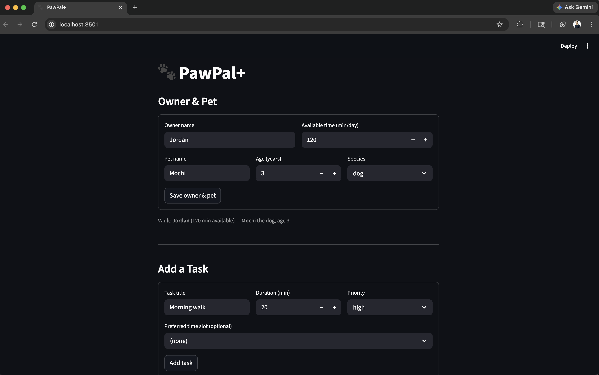

# PawPal+ (Module 2 Project)

You are building **PawPal+**, a Streamlit app that helps a pet owner plan care tasks for their pet.

## Scenario

A busy pet owner needs help staying consistent with pet care. They want an assistant that can:

- Track pet care tasks (walks, feeding, meds, enrichment, grooming, etc.)
- Consider constraints (time available, priority, owner preferences)
- Produce a daily plan and explain why it chose that plan

Your job is to design the system first (UML), then implement the logic in Python, then connect it to the Streamlit UI.

## What you will build

Your final app should:

- Let a user enter basic owner + pet info
- Let a user add/edit tasks (duration + priority at minimum)
- Generate a daily schedule/plan based on constraints and priorities
- Display the plan clearly (and ideally explain the reasoning)
- Include tests for the most important scheduling behaviors

## Smarter Scheduling

The backend (`pawpal_system.py`) adds scheduling helpers beyond the basic greedy day planner:

- **Sort by time** — `Scheduler.sort_by_time()` returns scheduled items in true chronological order (by `start_minute`), regardless of how they were inserted.
- **Filter** — `filter_by_status()` keeps completed vs. pending tasks; `filter_by_pet()` narrows a combined multi-pet list to one pet.
- **Recurring tasks** — `RecurringTask` supports daily / weekdays / weekends / weekly cadences (`is_active_today`). Marking one complete returns a **new** task with the next due date (`timedelta`: +1 day for daily-style, +1 week for weekly).
- **Conflict detection** — `Scheduler.detect_conflicts()` finds overlapping time windows (same or different pets) without raising; callers can print warnings. See `main.py` for terminal demos and `tests/test_pawpal.py` for automated checks.

## Getting started

### Setup

```bash
python -m venv .venv
source .venv/bin/activate  # Windows: .venv\Scripts\activate
pip install -r requirements.txt
```

### Suggested workflow

1. Read the scenario carefully and identify requirements and edge cases.
2. Draft a UML diagram (classes, attributes, methods, relationships).
3. Convert UML into Python class stubs (no logic yet).
4. Implement scheduling logic in small increments.
5. Add tests to verify key behaviors.
6. Connect your logic to the Streamlit UI in `app.py`.
7. Refine UML so it matches what you actually built.

## Testing PawPal+

Run the full test suite from the project root:

```bash
python -m pytest tests/test_pawpal.py -v
```

### What the tests cover

| Test class | # tests | What it verifies |
|---|---|---|
| `TestMarkComplete` | 3 | A task starts incomplete, `mark_complete()` flips it to done, and calling it twice is safe. |
| `TestPetTaskAddition` | 4 | `Pet.add_task()` increments `task_count` correctly and the stored task is the same object. |
| `TestSortByTime` | 3 | `sort_by_time()` returns entries in chronological order, handles already-sorted input, and does not mutate the original list. |
| `TestRecurrenceLogic` | 4 | `RecurringTask.mark_complete()` spawns a new task with the correct next due date (daily +1 day, weekly +7 days), preserves all attributes, and returns an independent instance. |
| `TestConflictDetection` | 5 | `detect_conflicts()` flags same-start-time clashes, partial overlaps, returns nothing for adjacent or separated tasks, and finds all pairs when three tasks collide. |

### Confidence level

**4 / 5 stars** — The core scheduling loop, sorting, recurrence spawning, and conflict detection are all covered with passing tests. One star is held back because edge cases like zero-duration tasks, midnight wraparound, and very large task lists are not yet tested.

### Demo
<a href="demopawpal.png" target="_blank"></a>.
